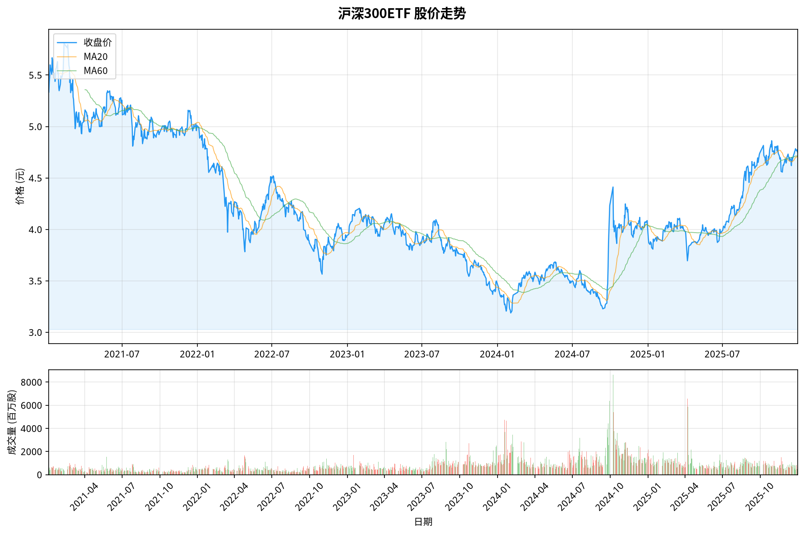
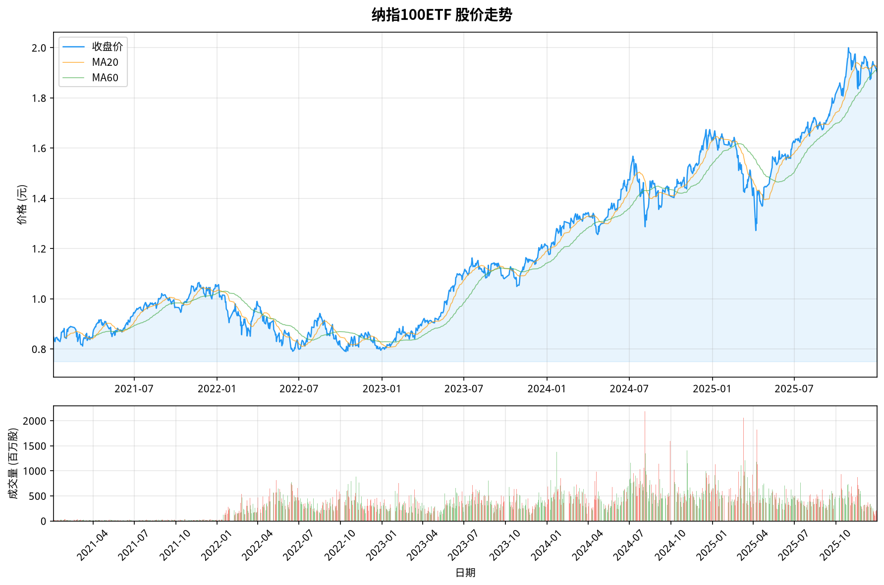
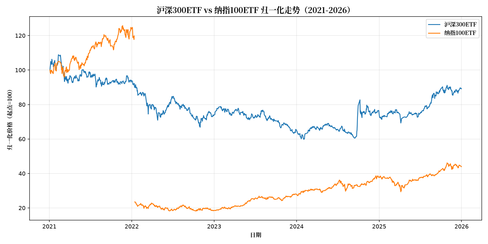
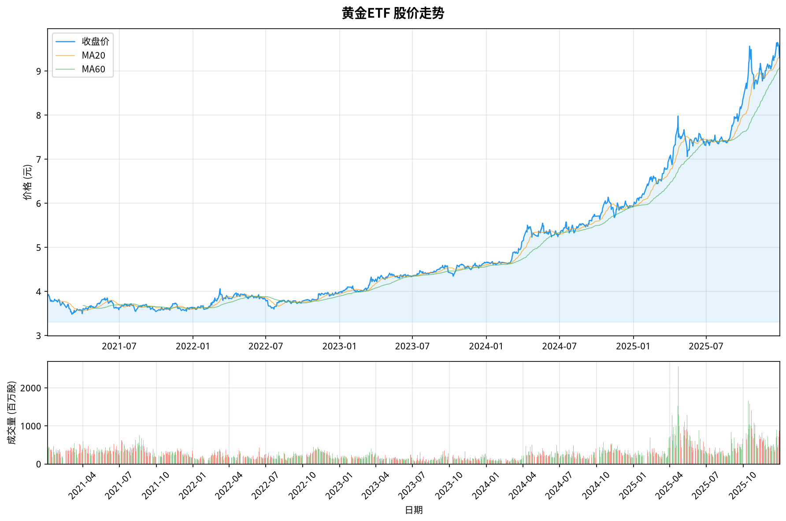
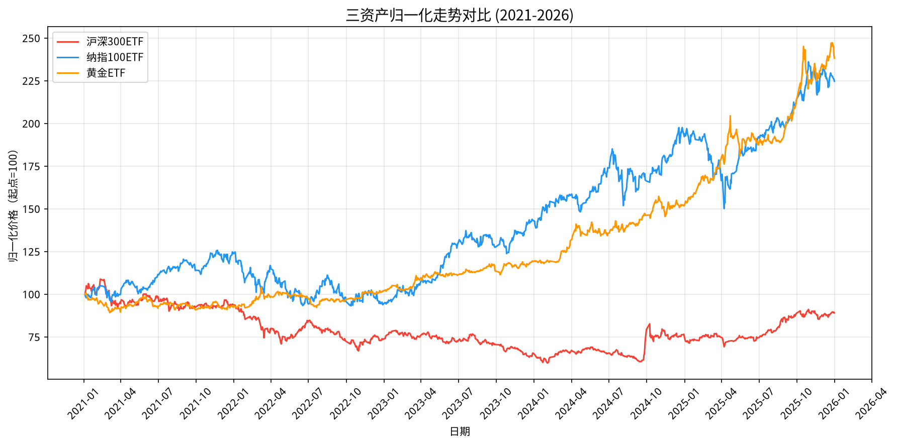

# 数据获取基础 - akshare 替代 yfinance

## 目标

获取 510300（沪深300ETF）的历史数据，保存到变量 `df`，索引为 `DatetimeIndex`，列名含 `Close`。

## 为什么不用 yfinance？

yfinance 请求雅虎财经接口有**频率限制**（`YFRateLimitError`），而且对中国 A 股支持不好。改用 akshare（数据源为东方财富）速度更快、更稳定。

## 环境准备

```bash
python3 -m venv /tmp/yf_env
source /tmp/yf_env/bin/activate
pip install akshare pandas
```

## 核心代码

```python
import akshare as ak
import pandas as pd

# 获取 510300（沪深300ETF）日线数据
df = ak.fund_etf_hist_em(
    symbol="510300",
    period="daily",
    start_date="20210101",
    adjust="qfq"      # 前复权，等价于 yfinance 的 auto_adjust=True
)

# 日期列 → DatetimeIndex
df['日期'] = pd.to_datetime(df['日期'])
df = df.set_index('日期')
df.index.name = 'Date'

# 重命名关键列
df = df.rename(columns={
    '开盘': 'Open', '收盘': 'Close',
    '最高': 'High', '最低': 'Low', '成交量': 'Volume',
})

df = df[['Close', 'High', 'Low', 'Open', 'Volume']]
print(df.head())
```

## 运行结果

```
                Close     High      Low    Open     Volume
Date
2021-01-04  4.843   4.875   4.789   4.789   569863500
2021-01-05  4.942   4.954   4.830   4.830   701673700
2021-01-06  4.991   5.023   4.956   4.956   422012500
```

### 股价走势图



## 参数对照

| akshare 参数 | 说明 |
|-------------|------|
| `symbol="510300"` | ETF 代码（**不带** `.SS`/`.SZ` 后缀） |
| `period="daily"` | 日线数据 |
| `start_date="20210101"` | 格式 YYYYMMDD |
| `adjust="qfq"` | 前复权 |

> **`.SS` / `.SZ` 是什么？** 一些数据源（如 yfinance、新浪）需要带市场后缀区分交易所：`.SS` = 上海证券交易所，`.SZ` = 深圳证券交易所。akshare 的东方财富（`_em`）接口**不需要**这些后缀，直接写纯数字代码即可。

## akshare 常用函数速查

```python
# A 股日线（东财，支持复权）
ak.stock_zh_a_hist(symbol="600519", period="daily", adjust="qfq")

# ETF 日线（东财，推荐）
ak.fund_etf_hist_em(symbol="510300", period="daily", adjust="qfq")

# ETF 日线（新浪，需手动复权）
ak.fund_etf_hist_sina(symbol="sh510300")  # 需加 "sh"/"sz" 前缀

# 指数日线
ak.stock_zh_index_daily(symbol="sh000001")

# 指数日线（东财，支持周/月）
ak.index_zh_a_hist(symbol="000300", period="daily")

# 实时全量行情
ak.stock_zh_a_spot_em()

# 完整速查 → [[akshare-reference|AKShare 数据接口速查]]
```

## 返回列说明

| 列名 | 含义 |
|------|------|
| Open | 开盘价（前复权） |
| High | 最高价（前复权） |
| Low | 最低价（前复权） |
| Close | 收盘价（前复权） |
| Volume | 成交量（股） |

## 注意事项

1. **虚拟环境**：务必在虚拟环境中运行，避免污染系统 Python
2. **日期格式**：`"YYYYMMDD"` 格式，不是 `"YYYY-MM-DD"`
3. **复权处理**：`adjust="qfq"` = 前复权，`adjust=""` = 不复权
4. **数据量**：2021-01-01 ~ 2025-12-31 共 1212 个交易日（参数传 `end_date="20260101"`，但 2026-01-01 为非交易日，实际取到最后一个交易日 2025-12-31）

## 速查入口

> 🔍 写策略时找数据接口？点这里。
> 
> - [[akshare-reference|AKShare 数据接口速查]] — 按数据类型分类的完整参考手册

## 深挖入口

> 🕳️ 遇到不熟悉的概念了？点进去深挖。

- [[../deep/forward-vs-backward-adjustment|前复权vs后复权]] — 前复权和后复权的区别、计算方式，以及对量化回测的影响
- 还想深挖？→ 分红除息的税费计算细则

---

## 扩展：美股数据获取（纳指100ETF）

除了 A 股 ETF，akshare 同样支持获取跨境 ETF（如纳指 100、标普 500）的数据。这里以 **513100（纳指100ETF）** 为例。

> 513100 跟踪纳斯达克 100 指数，成分股为苹果、微软、英伟达等美国科技龙头。

### 核心代码

```python
import akshare as ak
import pandas as pd

# 获取 513100（纳指100ETF）日线数据
df = ak.fund_etf_hist_em(
    symbol="513100",
    period="daily",
    start_date="20210101",
    end_date="20260101",
    adjust="qfq"      # 前复权
)

# 日期列 → DatetimeIndex
df['日期'] = pd.to_datetime(df['日期'])
df = df.set_index('日期')
df.index.name = 'Date'

# 重命名关键列
df = df.rename(columns={
    '开盘': 'Open', '收盘': 'Close',
    '最高': 'High', '最低': 'Low', '成交量': 'Volume',
})

df = df[['Close', 'High', 'Low', 'Open', 'Volume']]
print(df.head())
```

### 运行结果

```
                 Close    High     Low    Open     Volume
Date
2021-01-04  1.321   1.322   1.297   1.307   118119700
2021-01-05  1.336   1.336   1.321   1.329    78423900
2021-01-06  1.335   1.338   1.320   1.333    99095800
```

> ⚠️ 注意纳指 100ETF 的价格单位是**元（人民币）**，而非美元。净值按实时汇率折算。

### 股价走势图



### 与沪深300对比

纳指 100 和沪深 300 的归一化走势对比（2021-2025）：



纳指 100 在 2021-2024 年大幅跑赢沪深 300，体现出美股科技股的强劲表现。

---

## 扩展：黄金数据获取（黄金ETF）

黄金也是量化配置中常见的避险资产。akshare 同样可通过东方财富源获取 **518880（黄金ETF）** 数据。

> 518880 跟踪上海黄金交易所 AU99.99 价格，是国内规模最大的黄金 ETF。

### 核心代码

```python
import akshare as ak
import pandas as pd

# 获取 518880（黄金ETF）日线数据
df = ak.fund_etf_hist_em(
    symbol="518880",
    period="daily",
    start_date="20210101",
    end_date="20260101",
    adjust="qfq"      # 前复权
)

# 日期列 → DatetimeIndex
df['日期'] = pd.to_datetime(df['日期'])
df = df.set_index('日期')
df.index.name = 'Date'

# 重命名关键列
df = df.rename(columns={
    '开盘': 'Open', '收盘': 'Close',
    '最高': 'High', '最低': 'Low', '成交量': 'Volume',
})

df = df[['Close', 'High', 'Low', 'Open', 'Volume']]
print(df.head())
```

### 运行结果

```
                Close    High     Low    Open      Volume
Date
2021-01-04  3.651   3.665   3.645   3.658   171900800
2021-01-05  3.663   3.670   3.653   3.668   122317700
2021-01-06  3.664   3.670   3.653   3.662   126775700
```

### 股价走势图



### 黄金的避险属性

黄金在 A 股下跌期间往往能提供正收益，与股票的相关性接近于零（见下表），是做资产配置时的重要"压舱石"。

---

## 扩展：三资产归一化走势对比

将沪深300、纳指100、黄金放在一起对比，可以直观感受三类资产的差异化表现：



### 关键特征

| 资产 | 2021-2025 表现 | 特点 |
|------|--------------|------|
| **纳指100** | 大幅上涨 → 高位回调 | 高收益高波动，科技驱动 |
| **黄金** | 稳步上行 | 低波动，抗通胀，避险 |
| **沪深300** | 持续下跌 → 触底反弹 | 与 A 股经济周期绑定 |

### 多资产批量获取

当需要同时获取多个资产时，可以使用 `data_fetcher` 的批量接口：

```python
from data_fetcher import fetch_etf_data

symbols = {
    "510300": "沪深300ETF",
    "513100": "纳指100ETF",
    "518880": "黄金ETF",
}

data = {}
for symbol, name in symbols.items():
    df = fetch_etf_data(symbol=symbol, start_date="20210101")
    data[name] = df['Close']
    print(f"✓ {name}: {len(df)} 交易日")
```

完整的对比分析和组合回测见 [[../../02-backtest/notes/macro-analysis|三资产宏观分析]]。

---

## 参数对照

### akshare 统一参数

| 参数 | 说明 |
|------|------|
| `symbol="510300"` | ETF 代码（**不带** `.SS`/`.SZ` 后缀），适用于所有 ETF |
| `period="daily"` | 日线数据 |
| `start_date="20210101"` | 格式 YYYYMMDD，数据源取到该日期之前的最后一个交易日 |
| `adjust="qfq"` | 前复权 |

> **`.SS` / `.SZ` 是什么？** `.SS` 代表上海交易所，`.SZ` 代表深圳交易所。yfinance、新浪等数据源需要在代码后加后缀（如 `510300.SS`），但 akshare 东方财富接口**不需要**，直接写纯数字即可。

### 常用 ETF 代码

| 代码 | 名称 | 跟踪标的 |
|------|------|---------|
| 510300 | 沪深300ETF | 沪深300 指数 |
| 513100 | 纳指100ETF | 纳斯达克100 指数 |
| 518880 | 黄金ETF | 上海金 AU99.99 |

> 完整代码列表见 [[akshare-reference#常用标的代码|常用标的代码]]。

---

## 相关笔记

- [[../../02-backtest/notes/dca-backtest|DCA 定投回测]] — 基于本数据的 DCA 回测
- [[../../02-backtest/notes/ma-crossover-backtest|均线交叉策略回测]] — 基于 pandas 独立实现的策略回测
- [[../../02-backtest/notes/macro-analysis|三资产宏观分析]] — 沪深300/纳指100/黄金 相关性 + 组合回测
- [[../../02-backtest/notes/portfolio-allocation|组合分配系列笔记（入口）]] — 等权/风险平价/动量排名
