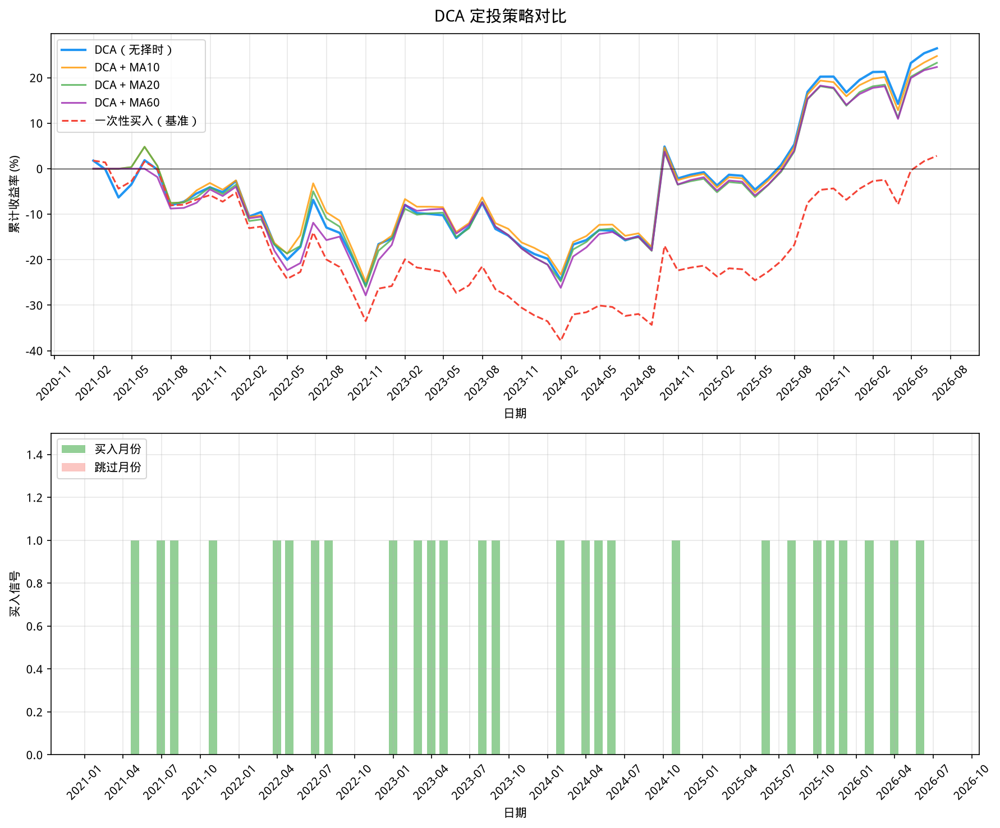

# 简单定投回测（DCA + 均线策略）

## 目标

在 510300（沪深300ETF）历史数据上实现：
1. **DCA 定投** — 每月第一个交易日投入 1000 元
2. **DCA + 均线择时** — 在 DCA 基础上，收盘价 > 均线时才买入
3. **一次性买入** — 作为基准对比

## 回测逻辑

```
DCA 定投：
  每月第1个交易日 → 每月份额 = 1000 / 收盘价 → 累计份额逐月累加
  → 月末市值 = 累计份额 × 当月最后收盘价
  → 累计收益率 = (市值 - 成本) / 成本

DCA + MA 择时：
  每月第1个交易日 → 若 Close > MA(period) 则买入，否则跳过
  → 无买入时成本/份额不变
  → 若从未买入，收益率 = 0（避免除零错误）

基准（一次性买入）：
  每月用与 DCA 相同的累计成本，在首日以收盘价一次性买入
```

## 核心代码

```python
import akshare as ak
import pandas as pd


def dca_ma_strategy(data: pd.DataFrame,
                    ma_period: int | None = None,
                    monthly_amount: float = 1000) -> pd.DataFrame:
    """DCA ± 均线择时回测"""
    monthly_first = data.resample('ME').first()
    monthly_last = data.resample('ME').last()
    first_close = monthly_first.iloc[0]['Close']
    has_ma = ma_period is not None
    ma_col = f'MA{ma_period}' if has_ma else None

    rows = []
    dca_cost, dca_shares = 0.0, 0.0

    for dt in monthly_first.index:
        close = monthly_first.loc[dt, 'Close']

        # 信号判断
        if has_ma:
            ma_val = monthly_first.loc[dt, ma_col]
            signal = 1 if (pd.notna(ma_val) and close > ma_val) else 0
        else:
            signal = 1

        # 买入
        if signal:
            shares = monthly_amount / close
            dca_cost += monthly_amount
            dca_shares += shares

        # 月末估值
        last_close = monthly_last.loc[dt, 'Close']
        portfolio_value = dca_shares * last_close
        ret = (portfolio_value - dca_cost) / dca_cost if dca_cost > 0 else 0.0

        # 基准
        bm_value = (dca_cost / first_close) * last_close
        bm_ret = (bm_value - dca_cost) / dca_cost if dca_cost > 0 else 0.0

        rows.append({
            'date': dt,
            'total_cost': round(dca_cost, 2),
            'total_shares': round(dca_shares, 4),
            'portfolio_value': round(portfolio_value, 2),
            'return': round(ret, 6),
            'benchmark_value': round(bm_value, 2),
            'benchmark_return': round(bm_ret, 6),
            'excess_return': round(ret - bm_ret, 6),
            **({'signal': signal} if has_ma else {})
        })

    return pd.DataFrame(rows)
```

## 运行结果

| 策略 | 累计收益 | 基准收益 | 买入/月数 | 总成本 | 最终市值 |
|------|---------|---------|-----------|-------|---------|
| **DCA（无择时）** | **+19.52%** | -4.40% | 60/60 | 60,000 | 71,710 |
| DCA + MA10 | +18.36% | -4.40% | 30/60 | 30,000 | 35,509 |
| DCA + MA20 | +16.83% | -4.40% | 24/60 | 24,000 | 28,038 |
| DCA + MA60 | +16.42% | -4.40% | 26/60 | 26,000 | 30,269 |

### 策略对比图



### 结果解读

- **DCA（无择时）** 累计收益最高（+19.52%），但本金投入也最多（60,000）
- **DCA + MA 择时** 买入次数大幅减少（24~30 次 vs 60 次），本金投入少一半以上
- 均线择时在这个区间内**并未提升收益率**，因为沪深300整体呈"先跌后反弹"走势，空仓期间错过了 2024 末的反弹
- **各策略均跑赢一次性买入**（-4.40%），体现了定投分散风险的优势

## `resample('ME')` 说明

```python
monthly_first = data.resample('ME').first()  # 每月第一个交易日
monthly_last  = data.resample('ME').last()   # 每月最后一个交易日
```

- `ME` = Month End frequency，按自然月分组
- `.first()` / `.last()` 取每个月的首/末交易日
- 自动跳过周末和节假日

## 注意事项

1. **交易成本**：本回测未考虑手续费、滑点等实际交易成本
2. **价格基准**：以收盘价成交，实际盘中可能不同
3. **复权处理**：使用前复权价格（`adjust="qfq"`）
4. **现金流**：假设每月固定日期投入，实际可自定义

## 相关笔记

- [[../../01-data/notes/akshare-basics|akshare 数据获取]] — 使用 akshare 获取数据
- [[ma-crossover-backtest]] — 均线交叉策略回测
