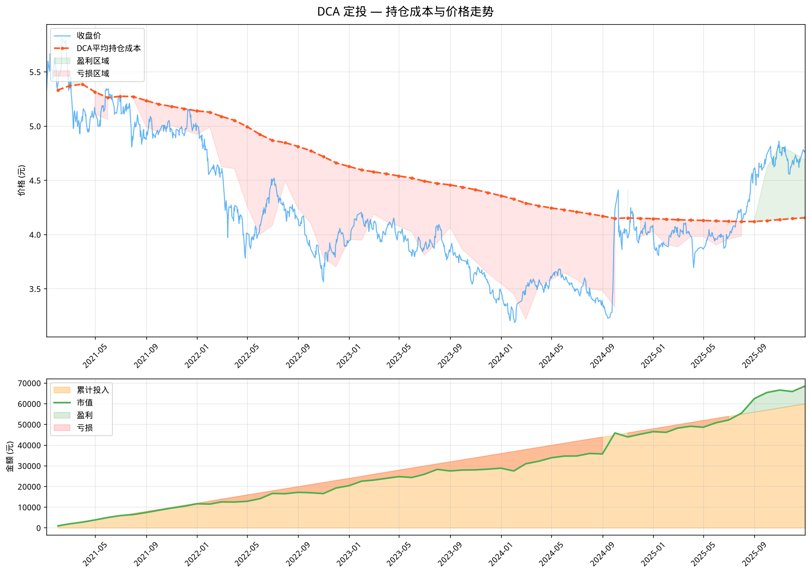
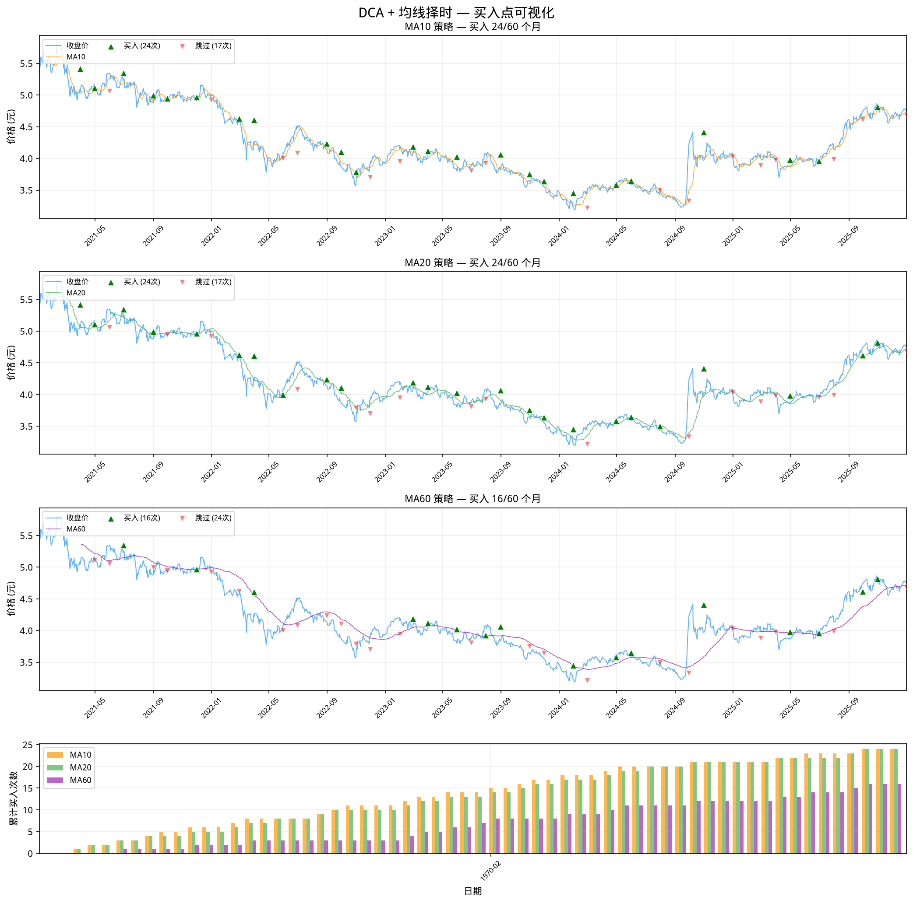
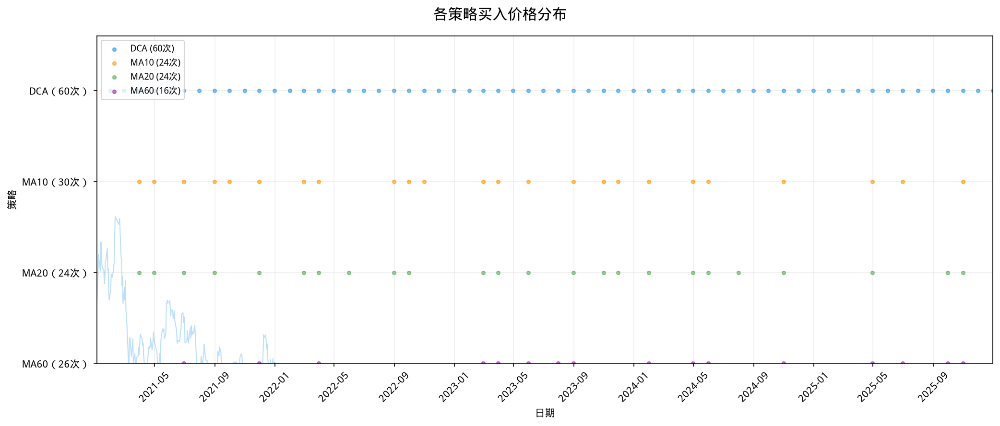
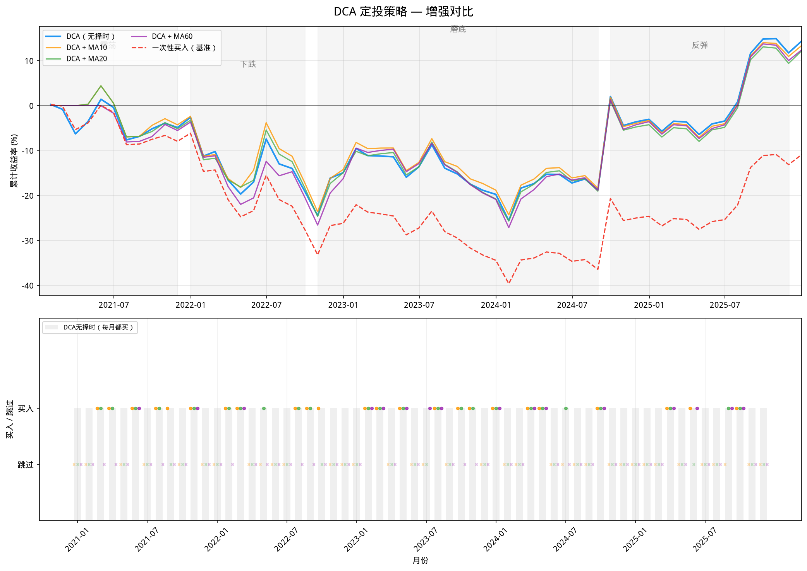

# 简单定投回测（DCA + 均线策略）

## 目标

在 510300（沪深300ETF）历史数据上实现：
1. **DCA 定投** — 每月第一个交易日投入 1000 元
2. **DCA + 均线择时** — 在 DCA 基础上，收盘价 > 均线时才买入
3. **一次性买入** — 作为基准对比

数据范围：2021-01-04 ~ 2025-12-31（60 个月）

## 回测逻辑

```
DCA 定投：
  每月第1个交易日 → 每月份额 = 1000 / 收盘价 → 累计份额逐月累加
  → 月末市值 = 累计份额 × 当月最后收盘价
  → 累计收益率 = (市值 - 成本) / 成本

DCA + MA 择时：
  每月第1个交易日 → 若 Close > MA(period) 则买入，否则跳过
  → 无买入时成本/份额不变
  → 若从未买入，收益率 = 0（避免除零错误）

基准（一次性买入）：
  每月用与 DCA 相同的累计成本，在首日以收盘价一次性买入
```

## 核心代码

```python
import akshare as ak
import pandas as pd


def dca_ma_strategy(data: pd.DataFrame,
                    ma_period: int | None = None,
                    monthly_amount: float = 1000) -> pd.DataFrame:
    """DCA ± 均线择时回测"""
    monthly_first = data.resample('ME').first()
    monthly_last = data.resample('ME').last()
    first_close = monthly_first.iloc[0]['Close']
    has_ma = ma_period is not None
    ma_col = f'MA{ma_period}' if has_ma else None

    rows = []
    dca_cost, dca_shares = 0.0, 0.0

    for dt in monthly_first.index:
        close = monthly_first.loc[dt, 'Close']

        # 信号判断
        if has_ma:
            ma_val = monthly_first.loc[dt, ma_col]
            signal = 1 if (pd.notna(ma_val) and close > ma_val) else 0
        else:
            signal = 1

        # 买入
        if signal:
            shares = monthly_amount / close
            dca_cost += monthly_amount
            dca_shares += shares

        # 月末估值
        last_close = monthly_last.loc[dt, 'Close']
        portfolio_value = dca_shares * last_close
        ret = (portfolio_value - dca_cost) / dca_cost if dca_cost > 0 else 0.0

        # 基准
        bm_value = (dca_cost / first_close) * last_close
        bm_ret = (bm_value - dca_cost) / dca_cost if dca_cost > 0 else 0.0

        rows.append({
            'date': dt,
            'total_cost': round(dca_cost, 2),
            'total_shares': round(dca_shares, 4),
            'portfolio_value': round(portfolio_value, 2),
            'return': round(ret, 6),
            'benchmark_value': round(bm_value, 2),
            'benchmark_return': round(bm_ret, 6),
            'excess_return': round(ret - bm_ret, 6),
            **({'signal': signal} if has_ma else {})
        })

    return pd.DataFrame(rows)
```

## 运行结果

| 策略 | 累计收益 | 基准收益 | 买入/月数 | 总成本 | 最终市值 |
|------|---------|---------|-----------|-------|---------|
| **DCA（无择时）** | **+14.37%** | -10.89% | 60/60 | 60,000 | 68,622 |
| DCA + MA10 | +13.37% | -10.89% | 30/60 | 30,000 | 34,010 |
| DCA + MA20 | +12.19% | -10.89% | 24/60 | 24,000 | 26,927 |
| DCA + MA60 | +12.40% | -10.89% | 26/60 | 26,000 | 29,225 |

### 策略对比图


上图：上子图为各策略收益率曲线，下子图为 MA20 策略的每月买入信号。

---

## DCA 持仓成本与价格走势

DCA 的核心原理是：**价格越低，同样 1000 元能买到的份额越多**，从而拉低平均持仓成本。



- **上图**：蓝色线为收盘价，橙色虚线为 DCA 的累计平均持仓成本。橙线始终在蓝线上下摆动 — 当价格高于平均成本时为盈利区域（绿色），低于时为亏损区域（红色）
- **下图**：橙色填充为累计投入金额，绿色线为持仓市值。当绿线高于橙色区域时表示盈利

关键观察：
- 2022-2024 年下跌期间，DCA 持续在低位买入，持仓成本被逐步拉低
- 2024 末反弹时，价格迅速超过平均成本，进入盈利区域
- 这就是 DCA 在"先跌后涨"行情中跑赢一次性买入的根本原因

---

## 各策略买入点可视化

不同均线周期导致不同的买入时机。以下是各策略在价格走势图上的买入点：



### 解读

| MA周期 | 买入次数 | 买入条件 | 特点 |
|--------|---------|---------|------|
| **MA10** | 30/60 | 价格 > 10日均线 | 短期均线，较灵敏，空仓期短 |
| **MA20** | 24/60 | 价格 > 20日均线 | 中期均线，节奏适中 |
| **MA60** | 26/60 | 价格 > 60日均线 | 长期均线，需趋势确认才入场 |

- **MA10** 买入最多（30次），空仓期最短，但也容易在下跌初期误买
- **MA20** 买入最少（24次），择时最严格
- **MA60** 在 2022-2024 下跌期间完全空仓（价格始终低于 MA60），直到 2024 末反弹才重新入场
- 第4行柱状图展示了各策略累计买入次数的分化过程

---

## 各策略买入价格分布

横向对比各策略在哪些价格水平买了、哪些月份跳过了：



- **DCA（无择时）**：每月都买，不论价格高低
- **MA10**：在 2022 年大跌初期仍有买入，2023-2024 磨底期部分跳过
- **MA20** / **MA60**：在 2022-2024 下跌期跳过更多月份，几乎只在反弹期间买入

结论：均线越长，对"趋势确认"的要求越高，空仓期越长。

---

## 增强对比：市场阶段 vs 策略表现

将整个回测期划分为四个市场阶段，观察各策略在不同阶段的表现：



### 四阶段分析

| 阶段 | 时间 | 市场状态 | 表现 |
|------|------|---------|------|
| **① 震荡** | 2021年 | 高位横盘 | 所有策略差异不大 |
| **② 下跌** | 2022年初 → 2022.10 | 大幅下跌 | DCA 持续买入拉低成本，亏损小于一次性买入 |
| **③ 磨底** | 2022.11 → 2024.09 | 低位徘徊 | 均线择时策略开始跳过买入，减少无效投入 |
| **④ 反弹** | 2024.10 → 2025年底 | 触底反弹 | 价格迅速突破均线，所有策略集体盈利 |

下图展示了各策略每月是否买入的对比：
- DCA（灰色底色）：每月都买
- 各圆点 = 买入，各叉号 = 跳过
- MA10 在下跌期仍有买入，MA20/MA60 则更谨慎

---

## 结果解读

1. **DCA（无择时）** 累计收益最高（+14.37%），但本金投入也最多（60,000）
2. **DCA + MA 择时** 买入次数大幅减少（24~30 次 vs 60 次），本金投入少一半以上
3. 均线择时在这个区间内**并未提升收益率**，因为沪深300整体呈"先跌后反弹"走势，空仓期间错过了 2024 末的反弹
4. **各策略均跑赢一次性买入**（-10.89%），体现了定投分散风险的优势

### 怎么选？

| 如果你的判断 | 推荐策略 |
|-------------|---------|
| 市场即将大幅下跌，想减少损失 | DCA + MA60（空仓最多，下跌期几乎不买） |
| 市场处于磨底期，想逐步建仓 | DCA + MA10（较灵敏，不会完全踏空） |
| 不想择时，相信长期持有 | 纯 DCA（简单粗暴，收益最高） |
| 想一次性抄底 | 不推荐一次性买入（该区间内表现最差） |

---

## `resample('ME')` 说明

```python
monthly_first = data.resample('ME').first()  # 每月第一个交易日
monthly_last  = data.resample('ME').last()   # 每月最后一个交易日
```

- `ME` = Month End frequency，按自然月分组
- `.first()` / `.last()` 取每个月的首/末交易日
- 自动跳过周末和节假日

---

## 代码文件

- `02-backtest/code/dca_backtest.py` — 回测模块
- `02-backtest/code/dca_visualize.py` — 可视化图表生成

---

## 注意事项

1. **交易成本**：本回测未考虑手续费、滑点等实际交易成本
2. **价格基准**：以收盘价成交，实际盘中可能不同
3. **复权处理**：使用前复权价格（`adjust="qfq"`）
4. **现金流**：假设每月固定日期投入，实际可自定义

## 相关笔记

- [[../../01-data/notes/akshare-basics|akshare 获取 ETF 数据]] — 使用 akshare 获取数据
- [[ma-crossover-backtest|均线交叉策略回测]] — 均线交叉策略回测
- [[macro-analysis|三资产宏观分析]] — 沪深300/纳指100/黄金 相关性 + 组合回测
