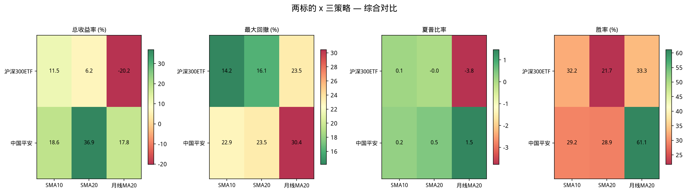
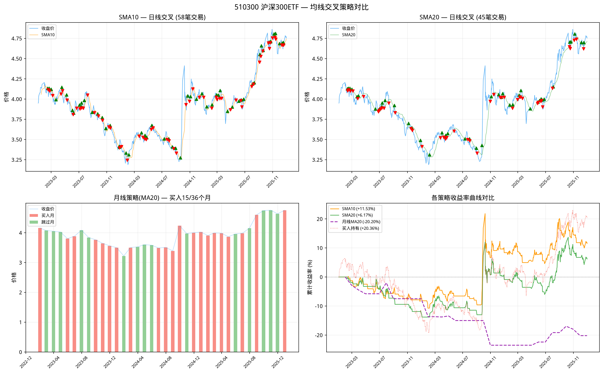
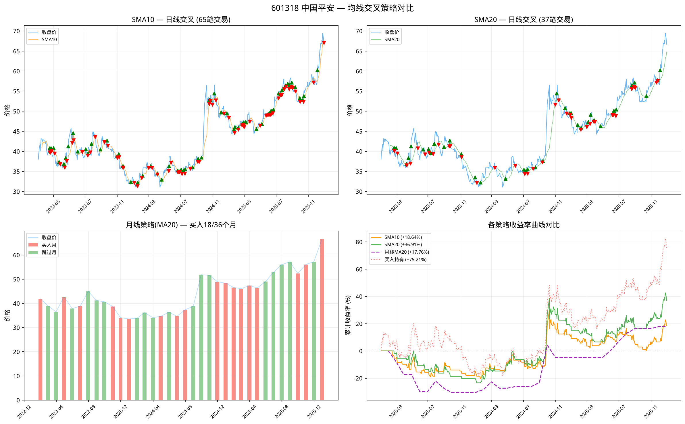

# 均线交叉策略回测 — 价格突破均线 + 卖出纪律

## 目标

对比三种均线策略在 **510300（沪深300ETF）** 和 **601318（中国平安）** 上的表现，核心差异是 **多了卖出机制**（与 DCA 定投只有买入不同）。

数据范围：2023-01-01 ~ 2025-12-31（3 年，727 个交易日 / 36 个月）

## 三种策略

| 策略 | 频率 | 买入条件 | 卖出条件 | 特点 |
|------|------|---------|---------|------|
| **SMA10 日线交叉** | 日线 | 收盘价 > MA10 | 收盘价 < MA10 | 短期均线，交易频繁 |
| **SMA20 日线交叉** | 日线 | 收盘价 > MA20 | 收盘价 < MA20 | 中期均线，节奏适中 |
| **月线策略(MA20)** | 月度 | 月初收盘价 > MA20 | 月末强制卖出 | 月度调仓，强制止损/止盈 |

日线交叉策略的逻辑：

```
close > MA → 持仓（信号=1）
close ≤ MA → 空仓（信号=-1）
当信号从 -1 变为 +1 → 全仓买入
当信号从 +1 变为 -1 → 全部卖出
```

月线策略的逻辑：

```
每月第一个交易日：
  若 close > MA → 以开盘价全仓买入
  否则 → 现金等待
每月最后一个交易日 → 强制全部卖出（无论盈亏）
```

月线策略与 DCA 定投的核心区别：**DCA 只有买入，没有卖出**；月线策略每月强制卖出，能锁定利润也能锁定亏损。

## 运行结果

### 510300 沪深300ETF

| 策略 | 累计收益 | 最大回撤 | 夏普比率 | 年化波动 | 交易次数 | 胜率 |
|------|---------|---------|---------|---------|---------|------|
| **SMA10 日线交叉** | **+11.53%** | -14.15% | 0.125 | 13.45% | 117 (58笔) | 32.20% |
| **SMA20 日线交叉** | **+6.17%** | -16.08% | -0.001 | 13.51% | 91 (45笔) | 21.74% |
| **月线策略(MA20)** | **-20.20%** | -23.49% | -3.779 | 41.36% | 30 (15个月) | 33.33% |
| **买入持有（基准）** | **-10.89%** | — | — | — | — | — |

> 月线策略年化波动率 41.36% 偏高，因为月线只有 36 个数据点，年化放大了月度波动。

### 601318 中国平安

| 策略 | 累计收益 | 最大回撤 | 夏普比率 | 年化波动 | 交易次数 | 胜率 |
|------|---------|---------|---------|---------|---------|------|
| **SMA10 日线交叉** | **+18.64%** | -22.89% | 0.242 | 22.47% | 130 (65笔) | 29.23% |
| **SMA20 日线交叉** | **+36.91%** | -23.50% | 0.460 | 22.78% | 75 (37笔) | 28.95% |
| **月线策略(MA20)** | **+17.76%** | -30.44% | 1.468 | 126.11% | 36 (18个月) | 61.11% |
| **买入持有（基准）** | **+1.38%** | — | — | — | — | — |

> 中国平安期间有分红除权（腾讯源未做 qfq 复权），实际收益率会略高于表中数值。但各策略使用同源数据，横向对比仍然有效。

### 综合对比



关键发现：
- **沪深300ETF 上，短期 SMA10 优于 SMA20：** +11.53% vs +6.17%，因为 300ETF 波动平缓，短期均线能更快捕捉反弹
- **中国平安上，中期 SMA20 远优于 SMA10：** +36.91% vs +18.64%，平安波动大，短期均线容易被来回打脸（更多假突破）
- **月线策略在沪深300上惨败（-20.20%）：** 月度频率太粗，错过了中间反弹，每次月末强制卖出都卖在低点
- **月线策略在平安上尚可（+17.76%）：** 平安在 2024-2025 呈趋势上涨，月度调仓反而减少了不必要的进出

---

## 卖出纪律的影响

核心差异：与 DCA 定投对比，均线交叉策略**有了卖出机制**，这意味着：

### DCA vs 均线交叉（以 SMA20 为例）

| 维度 | DCA 定投 | 均线交叉(SMA20) |
|------|---------|---------------|
| 买入条件 | 每月固定买入 | 价格 > MA20 才买入 |
| 卖出条件 | **无（永不平仓）** | **价格 < MA20 即卖出** |
| 下跌期 | 持续买入拉低成本 | 空仓等待，避免亏损 |
| 反弹期 | 吃到全部涨幅 | 等突破确认后再入场，略晚一步 |
| 牛市中 | 赚最多（无卖出） | 可能被洗出去 |
| 震荡市中 | 可能高位站岗 | 空仓减少损失 |

### 实际影响

- **沪深300 2023-2025 先跌后震荡**：SMA20 频繁进出，63 笔交易大部分是小亏（胜率仅 21.74%），净收益反而不如 SMA10 的 58 笔交易
- **中国平安同期先跌后涨**：SMA20 在 2024 年反弹确认后才入场，37 笔交易却赚了 +36.91%，远超买入持有的 +1.38%

**结论：卖出纪律在下跌市中保护本金，但在震荡市中增加交易成本。**

---

## 各标的策略对比图

### 510300 沪深300ETF



- **左列：** SMA10（上）和 SMA20（下）的日线买卖信号。可见 SMA20 信号更少，但每次持仓时间更长
- **右上：** 月线策略的月度买入/跳过信号。红色柱子（跳过月）集中在 2023-2024 下跌期
- **右下：** 三条收益率曲线叠加。SMA10（橙色）在 2024 初开始跑赢 SMA20（绿色），月线策略（紫色虚线）持续垫底

### 601318 中国平安



- **SMA20 日线交叉（绿色）显著跑赢：** 2024 年平安从 30 元涨到 55 元，SMA20 趋势跟踪完整吃到了主升浪
- **SMA10 交易过于频繁：** 在上涨中多次小亏卖出又高价买入，侵蚀了利润
- **月线策略在平安上表现不错：** 月度频率恰好匹配平安的趋势周期

---

## 结果解读

### 策略选择取决于标的特性

| 标的类型 | 推荐策略 | 原因 |
|---------|---------|------|
| 指数 ETF（低波动） | SMA10 日线交叉 | 短期均线更灵敏，快速捕捉反弹 |
| 个股（高波动趋势股） | SMA20 日线交叉 | 中期均线过滤假突破，吃主升浪 |
| 趋势明确资产 | 月线策略 | 减少日内噪声，低频交易省手续费 |
| 震荡市 / 下跌市 | 月线策略 / 现金 | 月线强制止损，避免深套 |

### 胜率 vs 盈亏比

三个策略的胜率都在 **21%~33%** 之间（日线）或 33%~61%（月线），但：
- 胜率低不代表亏损 — 盈利交易的幅度大于亏损交易
- SMA20 在平安上胜率仅 28.95%，但总收益高达 +36.91%
- 这是趋势跟踪策略的典型特征：**小亏大赚**

### 与 DCA 定投的补充关系

- **DCA 定投**适合"长期看涨、不想择时"的投资者
- **均线交叉**适合"愿意止损、想控制回撤"的投资者
- 两者可以互补：用均线交叉判断大趋势方向，决定是否执行 DCA

---

## 核心代码

```python
def ma_crossover_strategy(data, fast_period=1, slow_period=20):
    # 计算均线
    data['MA_fast'] = data['Close'].rolling(fast_period).mean()
    data['MA_slow'] = data['Close'].rolling(slow_period).mean()
    
    # 信号：持仓(1) / 空仓(-1)
    data['signal'] = 0
    data.loc[data['MA_fast'] > data['MA_slow'], 'signal'] = 1
    data.loc[data['MA_fast'] <= data['MA_slow'], 'signal'] = -1
    
    # 交易信号：信号变化时
    data['trade_signal'] = data['signal'].diff()
    # trade_signal == 2  → 买入（-1 → 1）
    # trade_signal == -2 → 卖出（1 → -1）
```

完整实现见 `02-backtest/code/ma_strategy.py`，包含 `monthly_ma_strategy`（月线策略）、`compare_strategies_for_symbol`（多策略对比）、以及图表生成函数。

## 代码文件

- `02-backtest/code/ma_strategy.py` — 回测模块（含日线交叉 + 月线策略 + 对比图表）
- `02-backtest/code/data_fetcher.py` — 数据获取（ETF 通过 `fetch_etf_data`，股票通过 `fetch_stock_data`）

## 注意事项

1. **交易成本**：未考虑手续费、滑点。日线交叉 91~130 笔交易在实盘中成本可观
2. **价格基准**：以收盘价成交，实际盘中可能不同
3. **月线策略的波动率**：月度数据点少（36 个），年化后波动率偏高，参考意义有限
4. **复权处理**：腾讯源获取的数据未做 qfq 复权，分红除权导致价格偏低，但不影响策略横向对比
5. **仓位管理**：策略为满仓进/空仓出，未考虑分批建仓

## 相关笔记

- [[../../01-data/notes/akshare-basics|akshare 获取 ETF 数据]] — 使用 akshare 获取数据
- [[dca-backtest]] — 传统 DCA 定投策略（无卖出）
- [[macro-analysis|三资产宏观分析]] — 沪深300/纳指100/黄金 相关性 + 组合回测
