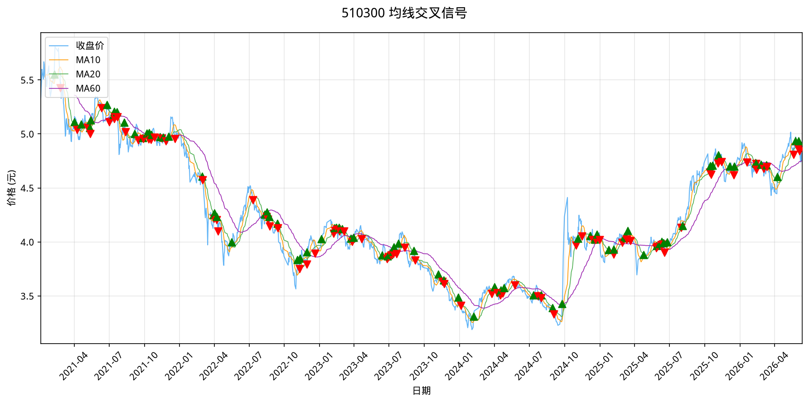

# 均线交叉策略回测（backtrader）

## 目标

对 6 个标的执行 SMA(1) 上穿 SMA(20) 均线交叉策略：
- 6 个标的各自独立运行（单资产投资宇宙）
- 金叉（SMA1 上穿 SMA20）→ 等权入场
- 死叉（SMA1 跌破 SMA20）→ 全部出场

## 回测配置

| 配置项 | 值 |
|-------|-----|
| **标的** | 510300(沪深300ETF) / 600519(茅台) / 000858(五粮液) / 601318(中国平安) / 000001(平安银行) / 600036(招商银行) |
| **时间窗** | 2023-01-01 ~ 2026-01-01（3年） |
| **信号** | 收盘价上穿 20 日均线（SMA1 > SMA20 → 买入，反之卖出） |
| **建仓** | 等权满仓（单资产 = 100%） |
| **出场** | 收盘价跌破 20 日均线 → 清仓 |
| **初始资金** | 100,000 元 |
| **实现** | 独立 pandas 实现（`02-backtest/code/ma_strategy.py`），不依赖第三方回测框架 |

## 核心代码

`ma_strategy.py` 的简化核心逻辑：

```python
# 计算均线
df['MA_fast'] = df['Close'].rolling(window=1).mean()   # SMA(1) ≡ 收盘价
df['MA_slow'] = df['Close'].rolling(window=20).mean()  # SMA(20)

# 生成信号
df['signal'] = 0
df.loc[df['MA_fast'] > df['MA_slow'], 'signal'] = 1   # 金叉 → 持仓
df.loc[df['MA_fast'] <= df['MA_slow'], 'signal'] = -1 # 死叉 → 空仓

# 检测信号变化（diff == 2 买入，diff == -2 卖出）
df['trade_signal'] = df['signal'].diff()

# 逐日回测
for date, row in df.iterrows():
    if row['trade_signal'] == 2:  # -1 → 1，买入
        shares = cash / close
        cash = 0
    elif row['trade_signal'] == -2:  # 1 → -1，卖出
        cash = shares * close
        shares = 0
```

完整实现见 `02-backtest/code/ma_strategy.py`，包含指标计算、交易记录、胜率计算、图表绘制等功能。

## 运行结果

| 标的 | 累计收益率 | 年化波动率 | 夏普比率 | 最大回撤 |
|-----|-----------|-----------|---------|---------|
| **中国平安(601318)** | **+40.59%** | 23.38% | 0.6196 | -30.80% |
| **招商银行(600036)** | **+33.91%** | 19.09% | 0.6254 | -27.31% |
| **沪深300ETF(510300)** | **+13.07%** | 14.43% | 0.3662 | -20.10% |
| **平安银行(000001)** | **+11.00%** | 19.07% | 0.2835 | -24.82% |
| **五粮液(000858)** | **+9.34%** | 22.09% | 0.2486 | -31.39% |
| **贵州茅台(600519)** | **-9.20%** | 16.99% | -0.1110 | -25.96% |

### 关键发现

1. **金融股表现突出** — 中国平安 +40.59%、招商银行 +33.91%，说明 SMA 交叉策略在金融板块效果较好
2. **茅台逆势下跌** — 唯一亏损标的（-9.2%），高端消费股在本策略下表现不佳
3. **波动率与收益不严格对应** — 五粮液波动率最高但收益仅 +9.34%

## SMA(1) 的策略本质

SMA(1) 等价于当日收盘价，Crossover(1, 20) 实际上是**价格突破均线策略**：
- 收盘价站上 20 日均线 → 买入
- 收盘价跌破 20 日均线 → 卖出

这是一个高频率的趋势跟踪策略，每次突破都会触发交易。

### 均线信号示意



## 回测框架对比

| 维度 | pandas 独立实现 | backtrader | open-xquant |
|------|---------------|------------|-------------|
| 代码复杂度 | 低，纯数组运算 | 中，策略类 + cerebro | 中，模块化 |
| 灵活性 | 最高，可任意定制 | 高，组件可插拔 | 低，受框架约束 |
| 可视化 | 需自行实现 | 内置 plot | 需自行实现 |
| 当前状态 | ✅ 主力（ma_strategy.py） | ✅ 主力（risk_parity.py） | ❌ 已废弃 |

## 相关笔记

- [[../../01-data/notes/akshare-basics|akshare 数据获取]] — akshare 数据获取
- [[dca-backtest]] — 传统 DCA 定投策略
- [[portfolio-allocation|组合分配：等权 vs 风险平价 vs 动量排名]] — 进阶组合策略（backtrader）
