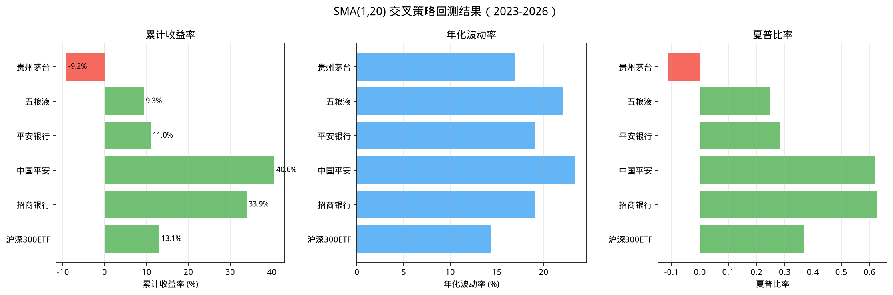

# open-xquant 均线交叉策略回测

## 目标

使用 open-xquant 框架，对 6 个标的执行 SMA(1) 上穿 SMA(20) 均线交叉策略：
- 6 个标的各自独立运行（单资产投资宇宙）
- 金叉（SMA1 上穿 SMA20）→ 等权入场
- 死叉（SMA1 跌破 SMA20）→ 全部出场

## 回测配置

| 配置项 | 值 |
|-------|-----|
| **标的** | 510300(沪深300ETF) / 600519(茅台) / 000858(五粮液) / 601318(中国平安) / 000001(平安银行) / 600036(招商银行) |
| **时间窗** | 2023-01-01 ~ 2026-01-01（3年） |
| **信号** | Crossover(SMA1, SMA20) — 即价格突破20日均线 |
| **建仓** | EqualWeightOptimizer（单资产 = 100%） |
| **出场** | ExitRule(SMA1 < SMA20) |
| **初始资金** | 100,000 元 |
| **数据源** | akshare → parquet（前复权） |

## 核心代码

```python
from oxq.core import Engine, Strategy
from oxq.data import LocalMarketDataProvider
from oxq.indicators import SMA
from oxq.portfolio.optimizers import EqualWeightOptimizer
from oxq.rules import ExitRule
from oxq.signals import Crossover
from oxq.trade import SimBroker
from oxq.universe import StaticUniverse

for symbol in SYMBOLS:
    universe = StaticUniverse(symbols=(symbol,))
    crossover = Crossover()
    crossover.required_indicators = {
        "sma_fast": (SMA(), {"column": "close", "period": 1}),
        "sma_slow": (SMA(), {"column": "close", "period": 20}),
    }
    strategy = Strategy(
        universe=universe,
        signals={"crossover": (crossover, {"fast": "sma_fast", "slow": "sma_slow"})},
        portfolio=EqualWeightOptimizer(),
    )
    engine = Engine()
    result = engine.run(
        strategy=strategy,
        market=LocalMarketDataProvider(),
        broker=SimBroker(),
        start="2023-01-01", end="2026-01-01",
        initial_cash=100_000.0,
        rules=[ExitRule(fast="sma_fast", slow="sma_slow")],
        data_start="2022-01-01",  # 供 SMA(20) warmup
    )
```

## 运行结果

| 标的 | 累计收益率 | 年化波动率 | 夏普比率 | 最大回撤 |
|-----|-----------|-----------|---------|---------|
| **中国平安(601318)** | **+40.59%** | 23.38% | 0.6196 | -30.80% |
| **招商银行(600036)** | **+33.91%** | 19.09% | 0.6254 | -27.31% |
| **沪深300ETF(510300)** | **+13.07%** | 14.43% | 0.3662 | -20.10% |
| **平安银行(000001)** | **+11.00%** | 19.07% | 0.2835 | -24.82% |
| **五粮液(000858)** | **+9.34%** | 22.09% | 0.2486 | -31.39% |
| **贵州茅台(600519)** | **-9.20%** | 16.99% | -0.1110 | -25.96% |

### 策略收益对比



### 关键发现

1. **金融股表现突出** — 中国平安 +40.59%、招商银行 +33.91%，说明 SMA 交叉策略在金融板块效果较好
2. **茅台逆势下跌** — 唯一亏损标的（-9.2%），高端消费股在本策略下表现不佳
3. **波动率与收益不严格对应** — 五粮液波动率最高但收益仅 +9.34%

## SMA(1) 的策略本质

SMA(1) 等价于当日收盘价，Crossover(1, 20) 实际上是**价格突破均线策略**：
- 收盘价站上 20 日均线 → 买入
- 收盘价跌破 20 日均线 → 卖出

这是一个高频率的趋势跟踪策略，每次突破都会触发交易。

### 均线信号示意


## 数据下载

```python
# A 股
ak.stock_zh_a_hist(symbol="600519", adjust="qfq")
# ETF
ak.fund_etf_hist_em(symbol="510300", adjust="qfq")
```

保存为 `~/.oxq/data/market/{symbol}.parquet`，由 `LocalMarketDataProvider` 读取。

## 使用的 oxq 核心模块

| 模块 | 作用 |
|------|------|
| `Engine.run` | 执行引擎，完成全流程 |
| `Crossover` | 检测快线上穿慢线的信号 |
| `SMA` | 简单移动平均线计算 |
| `EqualWeightOptimizer` | 等权分配 |
| `ExitRule` | 信号反转时平仓 |
| `StaticUniverse` | 固定标的池 |
| `SimBroker` | 模拟券商，收盘价成交 |

## 注意事项

1. **SMA(1) 等价于收盘价**：但 oxq 的 Crossover 信号要求列名引用，仍需通过 SMA indicator 生成
2. **Warmup**：`data_start="2022-01-01"` 提前加载数据供 SMA(20) 计算
3. **交易成本**：本回测未考虑手续费和滑点
4. **高频交易**：价格突破均线的策略信号频繁，实盘需注意交易成本

## 相关笔记

- [[../../01-data/notes/akshare-basics|akshare 数据获取]] — akshare 数据获取
- [[dca-backtest]] — 传统 DCA 定投策略
