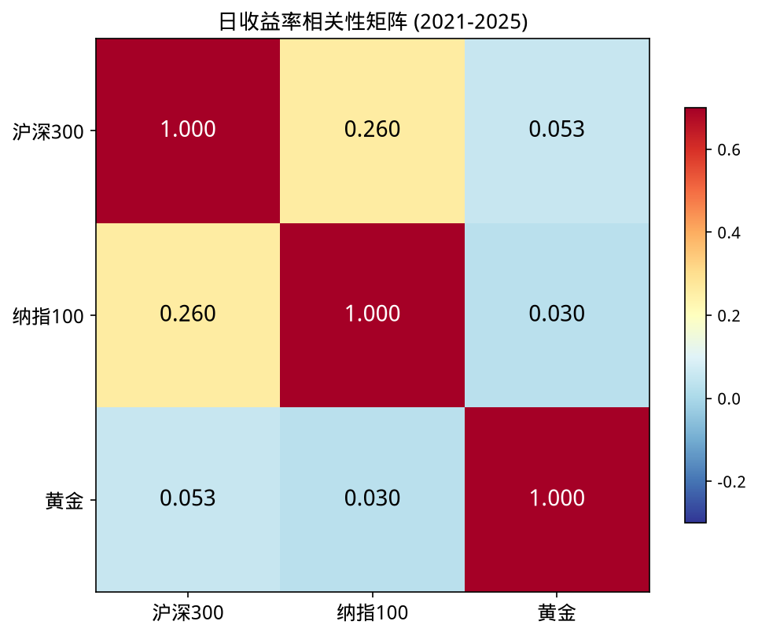
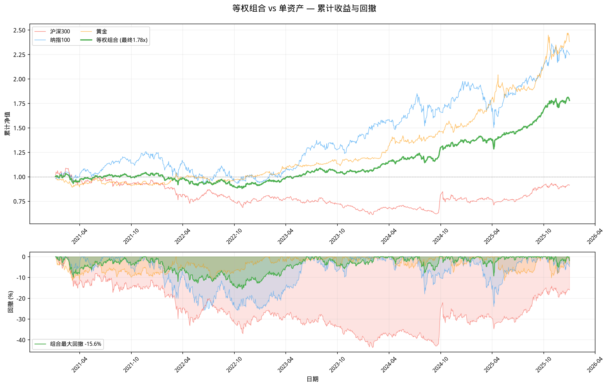

# 三资产宏观分析：沪深300 / 纳指100 / 黄金

## 目标

分析三类资产的相关性和组合效果：
- **沪深300ETF (510300)** — A股核心资产
- **纳指100ETF (513100)** — 美国科技龙头
- **黄金ETF (518880)** — 避险资产

时间窗：2021-01-01 ~ 2025-12-31（5年）

---

## 数据获取

推荐使用 `data_fetcher` 统一获取（新浪源，ETF 手动拆股检测）：

```python
import sys; sys.path.insert(0, "../01-data/code")
from data_fetcher import fetch_etf_data

df = fetch_etf_data(symbol="510300", start_date="20210101", end_date="20260101")
```

> 数据接口速查见 [[../../01-data/notes/akshare-reference|AKShare 数据接口速查]]。

---

## 相关性分析

### 日收益率相关性矩阵

计算方式：`df.pct_change().corr()`

| | 沪深300 | 纳指100 | 黄金 |
|---|---|---|---|
| **沪深300** | 1.00 | 0.26 | 0.05 |
| **纳指100** | 0.26 | 1.00 | 0.03 |
| **黄金** | 0.05 | 0.03 | 1.00 |

### 相关性热力图



### 解读

- **沪深300 ↔ 纳指100**：0.26（低相关）— 中美股市有一定联动，但不强
- **沪深300 ↔ 黄金**：0.05（几乎无关）— A股和黄金走势独立
- **纳指100 ↔ 黄金**：0.03（几乎无关）— 科技股和黄金完全独立

**结论**：三资产相关性极低，分散效果显著。

---

## 组合 vs 单押对比

### 策略设定

- **等权组合**：三资产各 1/3 权重，每月再平衡
- **单押沪深300**：100% 持有沪深300ETF

### 回测指标 (2021-2025)

| 指标 | 等权组合 | 单押沪深300 | 差异 |
|------|---------|------------|------|
| **累计收益率** | +77.48% | -10.24% | +87.72% |
| **年化波动率** | 11.92% | 18.19% | -6.27% |
| **最大回撤** | -15.61% | -43.67% | +28.06% |

### 累计收益率对比图



### 解读

1. **收益**：等权组合 +77%，单押沪深300 亏 10% — 分散投资带来 87% 的超额收益
2. **波动**：组合波动率 12%，单押 18% — 分散降低了风险
3. **回撤**：组合最大回撤 -16%，单押 -44% — 分散大幅降低了极端风险

---

## 归一化走势对比


### 走势解读

- **纳指100**：2021-2024 大幅上涨，2024 后回调
- **沪深300**：2021-2024 持续下跌，2024 后反弹
- **黄金**：2022 后持续上涨，避险属性明显

---

## 核心结论

1. **分散投资有效**：三资产相关性 <0.3，组合效果显著
2. **风险收益双赢**：等权组合同时提高了收益、降低了风险
3. **黄金避险**：在 A 股下跌期间，黄金提供了正收益
4. **全球配置价值**：中美股市+黄金的组合，是经典的全球配置策略

---

## 代码文件

- `02-backtest/code/macro_analysis.py` — 完整分析脚本
- `02-backtest/code/etf_prices.csv` — 三资产收盘价数据

## 相关笔记

- [[../../01-data/notes/akshare-basics|akshare 数据获取]]
- [[../../01-data/deep/forward-vs-backward-adjustment|前复权 vs 后复权]]
- [[dca-backtest|DCA 定投回测]]
