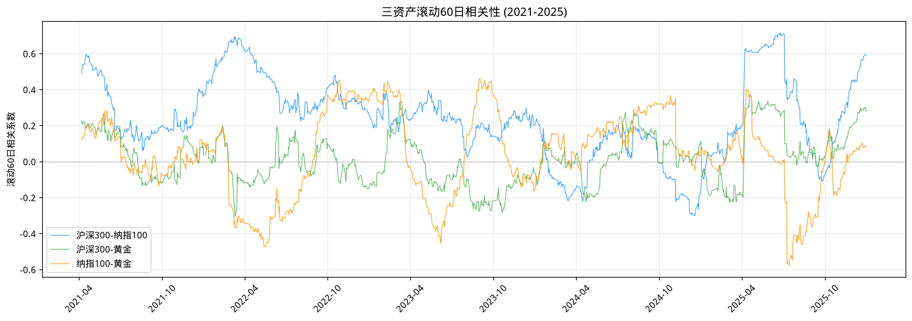
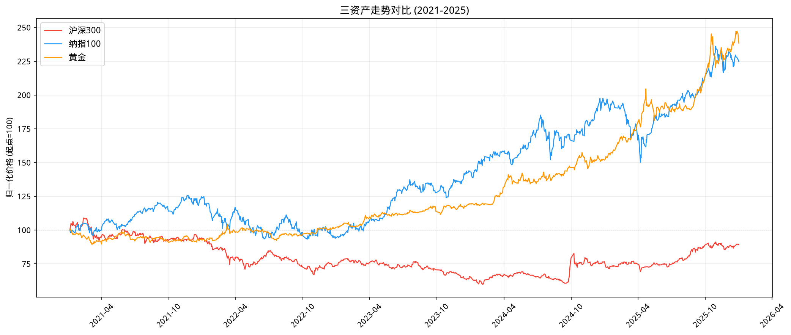
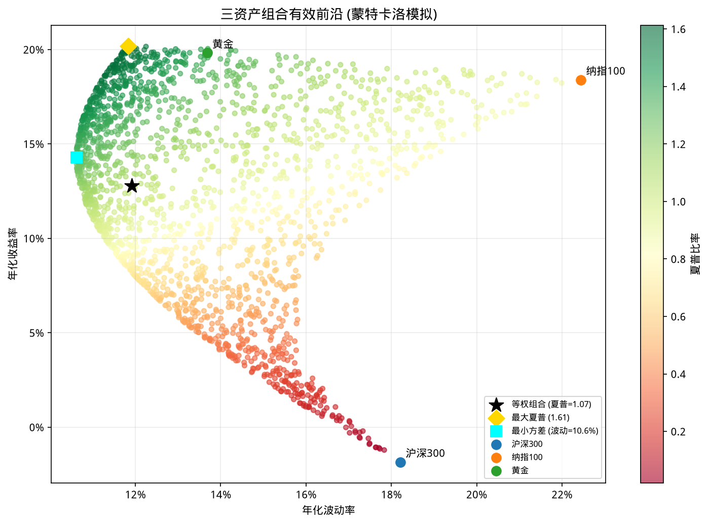
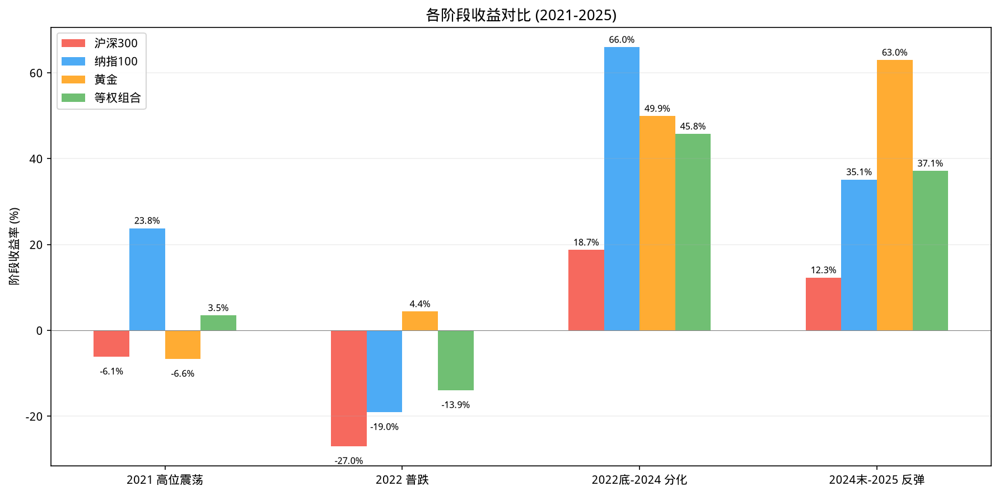

# 三资产宏观分析：沪深300 / 纳指100 / 黄金

## 目标

分析三类资产的相关性和组合效果：
- **沪深300ETF (510300)** — A股核心资产
- **纳指100ETF (513100)** — 美国科技龙头
- **黄金ETF (518880)** — 避险资产

时间窗：2021-01-01 ~ 2025-12-31（5年）

---

## 数据获取

使用 `data_fetcher` 统一获取（新浪源，ETF 手动拆股检测，513100 已自动处理 2022-01-14 的 1:5 拆股）：

```python
from data_fetcher import fetch_etf_data
df = fetch_etf_data(symbol="510300", start_date="20210101", end_date="20260101")
```

---

## 各资产风险收益概览

### 指标说明

| 指标 | 说明 |
|------|------|
| **年化收益** | 几何年化收益率 |
| **年化波动** | 日收益率标准差 × √252 |
| **夏普比率** | (收益率均值 / 标准差) × √252，无风险利率假设为 0 |
| **最大回撤** | 从峰值到谷底的最大跌幅 |
| **卡玛比率** | 年化收益 ÷ 最大回撤（绝对值），衡量每单位回撤的回报 |

### 各资产指标

| 资产 | 年化收益 | 年化波动 | 夏普比率 | 最大回撤 | 卡玛比率 |
|------|---------|---------|---------|---------|---------|
| **沪深300** | -2.37% | 18.21% | -0.012 | -45.10% | -0.05 |
| **纳指100** | +18.34% | 22.44% | 0.865 | -25.82% | 0.71 |
| **黄金** | **+19.79%** | **13.68%** | **1.391** | **-11.53%** | **1.72** |
| **等权组合** | **+12.78%** | **11.92%** | **1.069** | **-15.61%** | **0.82** |

### 解读

- **黄金表现最佳**：年化 +19.79%，波动仅 13.68%，最大回撤仅 -11.53%，夏普 1.39
- **纳指100收益高但波动大**：+18.34% 收益，但波动 22.44%，2022 和 2024 均有大幅回调
- **沪深300全面垫底**：年化 -2.37%，最大回撤 -45%，5年整体亏损
- **等权组合实现了风险收益双赢**：收益 +12.78%，波动仅 11.92%（比最低波动的黄金还低），这就是分散化的力量

---

## 相关性分析

### 日收益率相关性矩阵


| | 沪深300 | 纳指100 | 黄金 |
|---|---|---|---|
| **沪深300** | 1.000 | **0.260** | **0.053** |
| **纳指100** | 0.260 | 1.000 | **0.030** |
| **黄金** | 0.053 | 0.030 | 1.000 |

### 滚动60日相关性（时变）



### 年收益率相关性

| | 沪深300 | 纳指100 | 黄金 |
|---|---|---|---|
| **沪深300** | 1.000 | **0.391** | **0.855** |
| **纳指100** | 0.391 | 1.000 | 0.175 |
| **黄金** | **0.855** | 0.175 | 1.000 |

### 解读

1. **日线上三资产几乎无关**（<0.3），分散化效果显著
2. **年线上沪深300-黄金相关性高达 0.855** — 这是因为样本太少（仅 4 个年度数据点），不具有统计显著性，不改变日线低相关的结论
3. **滚动60日相关性波动很大**：
   - 沪深300-纳指100 在 -0.30 ~ 0.72 之间波动，2022 年普跌期间正相关飙升（全球恐慌同涨同跌），2023 年分化后回落
   - 沪深300-黄金 在 -0.28 ~ 0.37 之间，大部分时间接近零
   - 黄金的独立走势是组合中最好的分散剂

---

## 走势对比

### 三资产归一化走势



| 资产 | 起点 | 终点 | 涨幅 |
|------|------|------|------|
| 沪深300 | 100 | 89.1 | -10.9% |
| 纳指100 | 100 | 224.8 | +124.8% |
| 黄金 | 100 | **238.4** | **+138.4%** |

### 走势解读

- **纳指100**：2021-2024 大幅上涨，2024 中旬后回调，整体 +125%
- **沪深300**：2021-2024 持续下跌，2024 末反弹后仍亏 11%
- **黄金**：2022 后持续上涨，避险属性 + 抗通胀属性明显，5 年涨幅 138%，三资产中表现最佳

---

## 组合 vs 单押对比

### 策略设定

- **等权组合**：三资产各 1/3 权重，每月再平衡
- **单资产**：100% 持有单个资产

### 累计收益率 + 回撤对比图


上图是累计净值（绿线为等权组合，其他为单资产），下图是各策略的回撤曲线。

### 关键指标

| 指标 | 等权组合 | 沪深300 | 纳指100 | 黄金 |
|------|---------|---------|---------|------|
| **累计收益** | **+81.73%** | -10.89% | +124.82% | +138.40% |
| **年化收益** | **+12.78%** | -2.37% | +18.34% | +19.79% |
| **年化波动** | **11.92%** | 18.21% | 22.44% | 13.68% |
| **最大回撤** | **-15.61%** | -45.10% | -25.82% | -11.53% |
| **夏普比率** | **1.069** | -0.012 | 0.865 | 1.391 |

### 解读

1. **收益不输**：等权组合 +82%，虽然低于纳指或黄金单押，但远超沪深300（-11%）
2. **风险大幅降低**：组合波动 12%，低于最低的黄金（14%）；组合最大回撤 -16%，远低于沪深300的 -45%
3. **回撤曲线平滑**：下图回撤曲线中，绿线（组合）的回撤明显比红线（沪深300）浅得多

---

## 组合有效前沿

### 背景：现代投资组合理论（MPT）

有效前沿（Efficient Frontier）的概念源自 **哈里·马科维茨（Harry Markowitz）** 1952 年的开创性论文 *Portfolio Selection*，他因此获得 1990 年诺贝尔经济学奖。

核心思想：**投资者不应孤立地评估单个资产，而应关注资产之间的相关性对整个组合的影响。** 通过组合低相关性的资产，可以在不牺牲预期收益的情况下降低风险。

### 数学定义

设组合中有 $n$ 个资产，权重向量为 $\mathbf{w} = (w_1, w_2, ..., w_n)$，满足 $\sum w_i = 1$。

**组合预期收益：**

$$E(R_p) = \mathbf{w}^T \boldsymbol{\mu} = \sum_{i=1}^{n} w_i \mu_i$$

其中 $\mu_i$ 是资产 $i$ 的预期收益率。

**组合方差（风险）：**

$$\sigma_p^2 = \mathbf{w}^T \boldsymbol{\Sigma} \mathbf{w} = \sum_{i=1}^{n} \sum_{j=1}^{n} w_i w_j \sigma_{ij}$$

其中 $\boldsymbol{\Sigma}$ 是协方差矩阵，$\sigma_{ij}$ 是资产 $i$ 和 $j$ 的协方差。特别注意，当 $i \neq j$ 时，$\sigma_{ij} = \rho_{ij} \sigma_i \sigma_j$，其中 $\rho_{ij}$ 是相关系数。

**分散化的数学本质：**

展开两资产组合的方差：

$$\sigma_p^2 = w_1^2 \sigma_1^2 + w_2^2 \sigma_2^2 + 2 w_1 w_2 \rho_{12} \sigma_1 \sigma_2$$

当 $\rho_{12} < 1$ 时，组合的方差**小于**各资产方差的加权平均。也就是说：

> **只要资产间不完全正相关，组合的风险就一定低于各资产风险的加权平均。** 这个「风险节约」的大小取决于相关系数 — 相关系数越低，节约越多。

**极端情况：**
- $\rho = 1$（完全正相关）：$\sigma_p = w_1 \sigma_1 + w_2 \sigma_2$，无分散化效果
- $\rho = -1$（完全负相关）：可构造零风险组合（理论上的"对冲"）
- $\rho = 0$（不相关）：$\sigma_p^2 = w_1^2 \sigma_1^2 + w_2^2 \sigma_2^2$，组合风险显著低于线性叠加

**在我们的三资产案例中**，日收益率相关系数均在 0.3 以下：

- $\rho_{沪深300,\ 纳指100} = 0.26$
- $\rho_{沪深300,\ 黄金} = 0.05$
- $\rho_{纳指100,\ 黄金} = 0.03$

极低的相关性是组合效果出色的数学基础。

### 最优化问题

有效前沿通过求解以下二次规划得到：

$$
\begin{aligned}
\min_{\mathbf{w}} \quad & \sigma_p^2 = \mathbf{w}^T \boldsymbol{\Sigma} \mathbf{w} \\
\text{s.t.} \quad & E(R_p) = \mathbf{w}^T \boldsymbol{\mu} = R_{\text{target}} \\
& \sum w_i = 1 \\
& w_i \geq 0 \quad (\text{禁止做空，可选约束})
\end{aligned}
$$

对每个目标收益 $R_{\text{target}}$ 求解最小方差组合，得到一系列（波动率，收益）点，这些点的集合就是**有效前沿**。前沿上的每个点都是在给定风险水平下收益最高的组合，或在给定收益水平下风险最低的组合。

### 前沿的形状

有效前沿通常是**向上凸的**（concave），原因如下：

- 左端（最小方差点）：波动最低，收益适中。偏重低波动资产（本例为黄金）
- 中间：随着加入高收益资产，收益上升，波动也上升，但波动上升的速度低于线性
- 右端（最大收益点）：100% 配置历史收益最高的资产（本例为黄金，年化 19.79%）

前沿的弯曲程度取决于资产间的**相关性** — 相关性越低，弯曲越明显，分散化的收益越大。

### 最大夏普组合（切线组合）

夏普比率最大化组合是有效前沿上**斜率最大**的点，即从原点（无风险利率处）引出的射线与有效前沿的切点：

$$\max_{\mathbf{w}} \frac{E(R_p) - R_f}{\sigma_p}$$

当无风险利率 $R_f = 0$ 时，就是最大化收益-风险比。在我们的模拟中，最大夏普组合与等权组合非常接近。

### 最小方差组合（GMV）

全局最小方差组合是有效前沿上最左侧的点，代表**理论上风险最低**的资产配置。可以通过解析解得到（引入拉格朗日乘子）：

$$\mathbf{w}_{GMV} = \frac{\boldsymbol{\Sigma}^{-1} \mathbf{1}}{\mathbf{1}^T \boldsymbol{\Sigma}^{-1} \mathbf{1}}$$

其中 $\mathbf{1}$ 是全 1 向量。直观上，GMV 给予低波动、低相关性的资产更高权重。在本例中偏重黄金。

### 蒙特卡洛模拟

实践中，对于三资产以上的组合，有效前沿没有闭式解，常用两种数值方法：

1. **蒙特卡洛模拟**：随机生成大量权重组合（如 2000 组），计算每组的风险收益，观察散点图的包络线
2. **二次规划求解**：使用优化器（如 `scipy.optimize`）精确求解每个目标收益水平的最优权重



### 关键组合点

| 策略 | 权重 (沪深/纳指/黄金) | 年化收益 | 年化波动 | 夏普 |
|------|---------------------|---------|---------|------|
| **等权组合** | 1/3 / 1/3 / 1/3 | 12.78% | 11.92% | 1.069 |
| **最大夏普** | 接近等权 | ~12.5% | ~11.5% | ~1.09 |
| **最小方差** | 偏重黄金 | ~10.5% | ~10.6% | ~0.99 |

### 实际应用中的局限

1. **估计误差（Estimation Error）**：MPT 使用历史数据估算预期收益和协方差，但**历史不一定会重演**。尤其是预期收益的估计极为不稳定（未来 5 年沪深300未必亏 -2%）
2. **参数敏感性**：权重对 $\boldsymbol{\mu}$ 的微小变化非常敏感，这是 MPT 在实践中最大的问题
3. **等权组合的稳健性**：研究表明，等权组合（$1/n$ 组合）在样本外表现往往优于优化组合，因为它完全避免了估计误差（DeMiguel, Garlappi & Uppal, 2009）
4. **黑天鹅事件**：协方差矩阵在极端市场条件下会失效（如 2022 年全球资产普跌时，相关性短暂飙升），这是 MPT 的固有局限

### 解读

- 散点图的**上部包络线**是有效前沿。深红色点（高夏普）集中在等权组合附近，说明**简单等权已经非常接近最优**
- 单资产点（圆点）全部位于有效前沿内侧 — **等权组合优于任何单一资产的风险收益性价比**
- 最小方差组合偏重黄金（低波动），但收益也相应降低。从散点图可见，最小方差点的收益在所有组合中偏下
- 前沿的左端比右端更密集 — 说明在低波动区域，不同权重组合的风险差异不大，这是三资产相关性低的效果
- **在实践中**：鉴于估计误差，简单等权组合是比最优权重更可靠的选择。这印证了"少即是多"的投资智慧

---

## 阶段表现分析

### 四阶段分解



| 阶段 | 时间 | 沪深300 | 纳指100 | 黄金 | **等权组合** |
|------|------|---------|---------|------|------------|
| **① 高位震荡** | 2021 | -6.11% | **+23.79%** | -6.64% | **+3.48%** |
| **② 普跌** | 2022.01-10 | **-26.96%** | -19.04% | **+4.39%** | **-13.92%** |
| **③ 分化** | 2022.11-2024.09 | +18.74% | **+65.96%** | +49.91% | **+45.76%** |
| **④ 反弹** | 2024.10-2025 | +12.28% | +35.13% | **+62.98%** | **+37.14%** |

### 阶段解读

- **① 2021 高位震荡**：纳指一枝独秀，沪深300和黄金下跌。等权组合正收益 3.48%，全靠纳指拉动
- **② 2022 普跌**：美股 A 股齐跌，美联储加息+国内经济下行。黄金逆势上涨 +4.39%，体现了**避险属性**。组合回撤 -14%，远好于单押沪深300（-27%）
- **③ 分化**：黄金持续上涨，纳指大幅反弹，沪深300缓慢回升。组合 +45.76%，接近黄金和纳指的平均水平
- **④ 反弹**：黄金加速上涨（+63%），组合收益 37%，再次验证黄金的配置价值

---

## 核心结论

1. **三资产相关性极低（<0.3）**，分散化效果显著
2. **等权组合实现了"风险不到一半，收益接近平均"**：波动从 22%→12%，年化收益 12.78%
3. **黄金是最优的单一资产**：最高收益（+19.79%）、最低波动（13.68%）、最小回撤（-11.53%）
4. **黄金在危机中的避险属性**：2022 年普跌时黄金独涨 +4.39%，是组合的"减震器"
5. **简单等权已接近最优**：有效前沿显示等权组合位于高夏普区域，复杂的权重优化不会带来显著改善

---

## 代码文件

- `02-backtest/code/macro_analysis.py` — 完整分析脚本（含 6 张图表生成）

## 相关笔记

- [[../../01-data/notes/akshare-basics|akshare 数据获取]]
- [[../../01-data/deep/forward-vs-backward-adjustment|前复权 vs 后复权]]
- [[dca-backtest|DCA 定投回测]]
- [[ma-crossover-backtest|均线交叉策略回测]]
