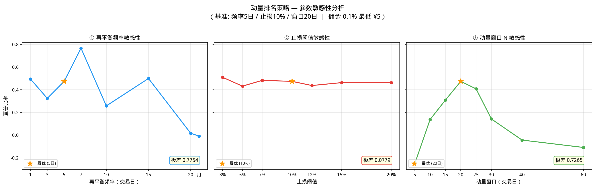

# 参数敏感性分析

> **阅读前**：建议先阅读 [[portfolio-allocation|组合分配系列]] 了解策略基础，以及 [[portfolio-rebalance|再平衡频率研究]] 和 [[portfolio-risk|止损保护与风险管理]] 了解单一参数优化的结论。

之前的系列笔记分别对再平衡频率、止损阈值、动量窗口做了单独优化，但选择的"最优值"都是在其他参数固定的前提下得出的。**本笔记通过单参数扫描，量化每个参数对夏普比率的影响程度（极差），并绘制三子图折线对比。**

---

## 目录

- [测试方法](#测试方法)
- [结果总览](#结果总览)
- [① 再平衡频率敏感性](#-再平衡频率敏感性)
- [② 止损阈值敏感性](#-止损阈值敏感性)
- [③ 动量窗口 N 敏感性](#-动量窗口-n-敏感性)
- [结论](#结论)
- [相关笔记](#相关笔记)

---

## 测试方法

- **策略**: 动量排名（RAM 加权）
- **回测区间**: 2021–2025（5 年）
- **佣金**: 0.1%，最低 ¥5
- **初始资金**: ¥100,000
- **标的**: 沪深300ETF / 纳指100ETF / 黄金ETF

### 三参数扫描范围

| 参数 | 扫描范围 | 原最优值 |
|------|---------|---------|
| 再平衡频率 | 1, 3, 5, 7, 10, 15, 20, "monthly" | 5日 |
| 止损阈值 | 3%, 5%, 7%, 10%, 12%, 15%, 20% | 10% |
| 动量窗口 N | 5, 10, 15, 20, 25, 30, 40, 60 | 20日 |

### 扫描方式

每次只变一个参数，其余两个固定在原最优值。例如扫描止损阈值时，固定频率=5日、动量窗口=20日。

---

## 结果总览



| 参数 | 极差（Δ夏普） | 敏感性评级 | 实际最优值 |
|------|-------------|-----------|-----------|
| 再平衡频率 | **0.7754** | 🔴 高敏感 | **7日**（原 5日） |
| 止损阈值 | **0.0779** | 🟢 低敏感 | 3%（但差异很小） |
| 动量窗口 N | **0.7265** | 🔴 高敏感 | **20日** ✅ |

> **极差 (Range)** = 该参数所有取值中的最大夏普比 − 最小夏普比。极差越大，说明策略对该参数越敏感。

---

## ① 再平衡频率敏感性


| 频率 | 夏普比 | 累计收益 |
|------|--------|---------|
| 1日 | 0.4953 | +65.85% |
| 3日 | 0.3242 | +28.44% |
| **5日** ★ 原最优 | **0.4741** | +39.02% |
| **7日** ← **实际最高** | **0.7664** | +45.34% |
| 10日 | 0.2577 | +27.36% |
| 15日 | 0.4994 | +39.36% |
| 20日 | 0.0165 | +15.09% |
| 月 | -0.0090 | +11.78% |

**极差: 0.7754 — 高敏感**

### 分析

- **频率 7 日**的夏普比 0.7664 是全部 23 组参数测试中的最高值，远超原最优 5 日（0.4741）
- 频率过低（月）或过高（3日）都会显著降低夏普比，但 1 日（每日）却表现不错（0.4953），这可能是因为每日再平衡能快速跟上动量变化
- 20 日（月内最低频）和月度出现负夏普，说明低频再平衡在该策略下不可行

### 修正建议

**考虑将"最优频率"从 5 日修正为 7 日**，并重新验证止损失和动量窗口的配合。

---

## ② 止损阈值敏感性

| 阈值 | 夏普比 | 累计收益 |
|------|--------|---------|
| **3%** ← 实际最高 | **0.5099** | +37.26% |
| 5% | 0.4320 | +36.27% |
| 7% | 0.4828 | +39.34% |
| 10% ★ 原最优 | 0.4741 | +39.02% |
| 12% | 0.4373 | +37.58% |
| 15% | 0.4629 | +38.59% |
| 20% | 0.4629 | +38.59% |

**极差: 0.0779 — 低敏感**

### 分析

- **止损阈值对夏普比影响很小！** 极差仅 0.078，远小于其他两个参数
- 3% 止损夏普比最高（0.5099），但其触发频率更高（需检查触发次数）
- 15% 和 20% 的夏普完全一致（0.4629），说明 >15% 的止损阈值基本不起作用（回撤超 15% 的事件极少）
- 策略本身通过动量排名（只做多正动量的标的）已经有一定的回调保护效果

### 结论

止损阈值不是该策略的关键参数。**在 3%~15% 范围内选择哪个阈值影响不大**，可根据风险偏好选择：保守选 5-7%，激进选 10-15%。

---

## ③ 动量窗口 N 敏感性

| N | 夏普比 | 累计收益 |
|---|--------|---------|
| 5 | **-0.2524** | +4.77% |
| 10 | 0.1371 | +18.04% |
| 15 | 0.3089 | +25.51% |
| **20** ★ ← 最优 | **0.4741** | +39.02% |
| 25 | 0.4078 | +37.86% |
| 30 | 0.1419 | +21.59% |
| 40 | **-0.0439** | +10.13% |
| 60 | **-0.1089** | +11.19% |

**极差: 0.7265 — 高敏感**

### 分析

- **N=20 是清晰的峰值**，N=25 也接近（0.4078），说明 20-25 天窗口是稳健选择
- N≤5 或 N≥40 时夏普转为负值，策略失效：
  - 窗口太短（≤5）：信号噪音过大，频繁错误切换
  - 窗口太长（≥40）：信号滞后，错过趋势转换时机
- N=10 和 N=30 也表现平庸（0.14 左右），说明窗口参数存在明显的"甜区"

### 结论

**动量窗口 N 应在 15-25 天范围内选择**，20 天是最优值。这个参数对策略效果至关重要。

---

## 结论

### 敏感性排序

```
再平衡频率 ≈ 动量窗口 N  ≫  止损阈值
  极差 0.7754     极差 0.7265      极差 0.0779
```

### 实践建议

| 参数 | 推荐值 | 优先级 |
|------|--------|--------|
| 再平衡频率 | **7 日**（替代原 5 日） | 🔴 需要修正 |
| 动量窗口 N | **20 日** ✅ | 🟢 确认有效 |
| 止损阈值 | **5-10%**（影响不大） | 🟢 维持原值 |

### 下一步

基于修正后的最优参数（频率=7日、止损=10%、窗口=20日）重新运行完整的策略对比回测，验证组合收益是否提升。

---

## 相关笔记

- [[portfolio-allocation|组合分配系列（入口）]] — 等权 vs 风险平价 vs 动量排名
- [[portfolio-rebalance|再平衡频率研究]] — 频率对比 + 佣金影响
- [[portfolio-risk|止损保护与风险管理]] — 止损/止盈对比 + 年份拆解
- [[portfolio-risk#动量窗口敏感性测试|动量窗口敏感性测试（按年份拆解）]]
- [[../code/param_sensitivity.py|敏感性分析代码]] — Python 回测脚本
